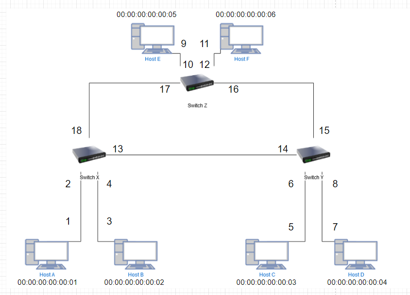
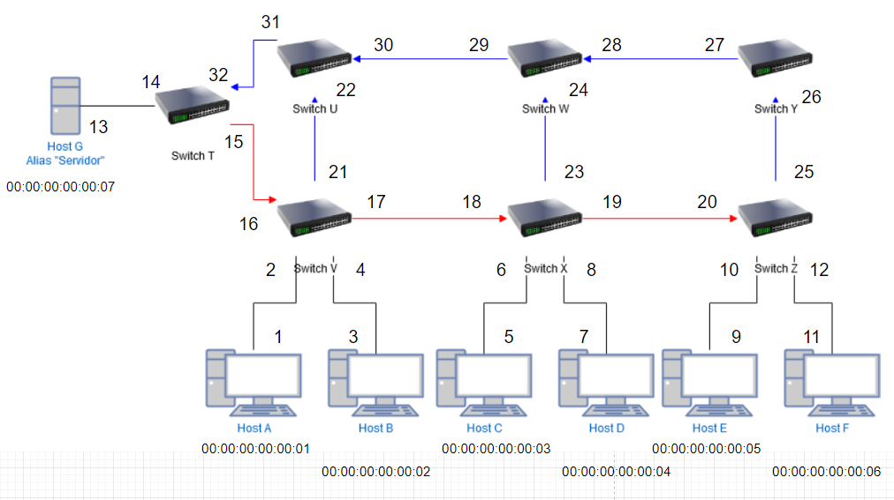

# Lab 3 Redes de Computadores
github: "https://github.com/xMuramasa/REDES/tree/master/Lab-3"

## Integrantes:
- Zhuo Chang 
- Martin Salinas Scussolin

## Requerimientos:
- Máquina virtual con mininet
- pox
- python 2.7

# Uso
## Parte 1 (se encuentra en la carpeta topo 1)

#### Diagrama de la Red 1:

- Pregunta: ¿Que ocurre al eliminar uno de los enlaces entre los switches?

- Respuesta: 
    - Para el caso de la red en su estado normal, no hay mayores dificultades para la trayectoria de los frames.

### Instrucciones de uso Parte 1:
- Se deben copiar los archivos de la carpeta forwarding del repositorio del laboratorio en el directorio "pox/pox/forwarding"

- Para ejecutar el controlador, se debe utilizar la siguiente linea para ejecutar:
    - Para comportamiento normal de la red:
        - python pox.py --verbose openflow.spanning_tree --no-flood --hold-down openflow.discovery forwarding.l2_learning
        
    - Para unidireccionalidad de frames:
        - python pox.py --verbose openflow.spanning_tree --no-flood --hold-down openflow.discovery forwarding.l2_learning2
    
    - Para maximización de link entre switches X e Y
        - python pox.py --verbose openflow.spanning_tree --no-flood --hold-down openflow.discovery forwarding.l2_learning3

- Para ejecutar mininet y la red, se debe hacer con la siguiente linea:
    - sudo mn --custom topologia1.py --topo mytopo --controller remote --switch ovsk --mac

-------------------- 

## Parte 2 (se encuentra en la carpeta topo 2)

#### Diagrama de la Red 2:

### Instrucciones de uso Parte 2:
- Se deben copiar los archivos de la carpeta forwarding del repositorio del laboratorio en el directorio "pox/pox/forwarding"

- Para ejecutar el controlador, se debe utilizar la siguiente linea para ejecutar:
        - python pox.py --verbose openflow.spanning_tree --no-flood --hold-down openflow.discovery forwarding.l2_learning4

- Para ejecutar mininet y la red, se debe hacer con la siguiente linea:
    - sudo mn --custom topologia2.py --topo mytopo --controller remote --switch ovsk --mac